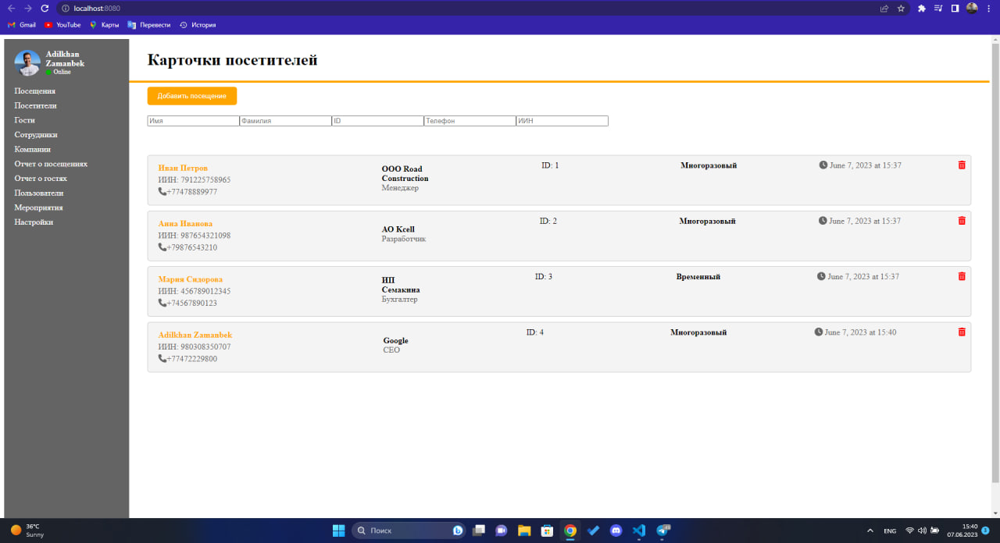

# visits

Проект "Система управления посетителями" представляет собой веб-приложение, разработанное с использованием Vue.js и компонентного подхода. Оно позволяет отслеживать, управлять и регистрировать информацию о посетителях.

## Основные функции

- Отображение списка посетителей с возможностью фильтрации по различным параметрам (имя, фамилия, ID, телефон, ИИН).
- Добавление нового посещения через модальное окно с соответствующими полями данных.
- Удаление посетителя из списка.
- Просмотр информации о каждом посетителе.

## Установка и настройка

1. Склонируйте репозиторий на ваш локальный компьютер.
2. Убедитесь, что у вас установлены Node.js и npm.
3. В командной строке перейдите в каталог проекта и выполните команду `npm install`, чтобы установить необходимые зависимости.
4. После установки зависимостей выполните команду `npm run serve`, чтобы запустить локальный сервер разработки.
5. Откройте браузер и перейдите по адресу `http://localhost:8080`, чтобы увидеть работающее приложение.
